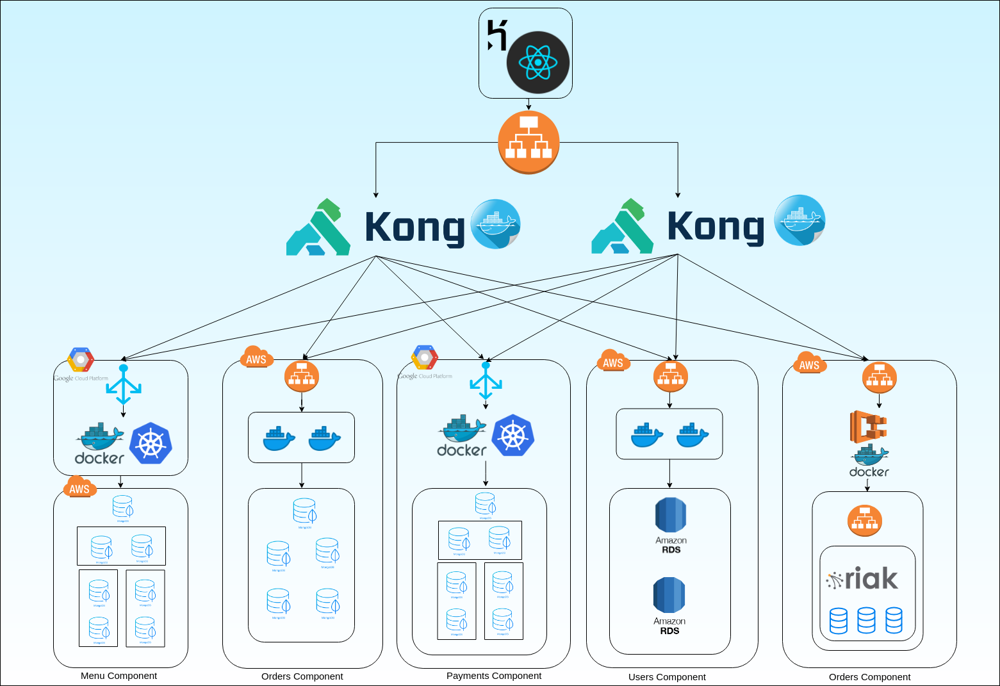

# TEAM JOURNAL #
<br>
## Counter Burger Application ##
## Team Members ##
- Aditi Kumari
- Aditya Doshatti
- Anand Kumar
- Ramya Iyer
- Sanjna Dhamejani

<br>

## Application structure ##
We have followed service-oriented architecture as a result of which the application has been decomposed into five microservices namely,
* Payments
* menu
* Order
* Location
* User

## Weekly development ##

### Week 1 (March 25 - March 31) ###
#### MoM (notes) ####
* Researched the various possible applications that we can develop
* Decided on the Application Domain
* Discussed the depth of scope that we want to cover
#### Result ####
* Decided to develop Counter burger Application
* Decided to use Microservices development technique

### Week 2 (April 1 - April 7) ###
#### MoM (notes) ####
* Decided the services to decompose 
* Discussed about the requirements and resources needed.
* Constructed the ncessary folder structure 
* Created Individual Journals to log personal progress
* Discussed about the relevant Database options
#### Result ####
* Everyone was assigned a microservice to work on.
* Go was decided to be the language for writing APIs.
* Decided on suitable databases for each microservice

### Week 3 (April 8 - April 14) ###
#### MoM (notes) ####
* Creation and configuration of databases
* started writing APIs
* Discussed the front-end technologies to be used.
* Flow of the website was decided

#### Result ####
* Narrowed down on React for developing UI

**Aditi**
* Created a MongoDB cluster for storing order details
* Setup backend to connect to the mongodb cluster and created a Ping Handler REST API for order service health check
* Created intital setup for the react front end and started building the microservice UI

**Aditya**
* Created a Sharded MongoDB cluster to store payments information 
* Setup backend to connect to the mongodb cluster and created a Ping Handler REST API for order service health chec
* Created intital setup for the react front end and started building the microservice UI

**Anand**
* Created a RIAK KV database cluster 
* Setup go backend to connect to RIAK cluster and tested it using PING handler API. 
* Created intital setup for the react front end and started building the microservice UI

**Ramya Iyer**
* Setup AWS RDS MySQL Database for storing user data
* Setup backend to connect to mysql and tested connection with the RDS was tested using API
* Created intital setup for the react front end and started building the microservice UI

**Sanjna**
* Setup MongoDB cluster with sharding
* Setup backend to connect to the mongodb cluster and created a Ping Handler REST API for order service health check
* Created intital setup for the react front end and started building the microservice UI

### Week 4 (April 15 - April 21) ###
#### MoM (notes) ####
* Discussed the necessary APIs for running the application

#### Result ####
* The ensuing week saw us working on the major functional APIs, the specifics of which are as follows

**Aditi**
* Created API for getting, posting and deleting the order details for cart 
* Completed UI development for the microservice

**Aditya**
* Created API for getting, posting and deleting the payment details  
* Completed UI development for the microservice

**Anand**
* Created API for getting, posting and deleting the Location details  
* Completed UI development for the microservice

**Ramya**
* Created API for getting, posting and deleting the User details  
* Completed UI development for the microservice

**Sanjna**
* Created API for getting, posting and deleting the Menu details  
* Completed UI development for the microservice

### Week 5 (April 22 - April 28) ###
#### MoM (notes) ####
* Discuss the appropriate deployment methods for individual services
* weighed pros and cons of various potential means

#### Result ####

**Aditi**
* Created docker hosts on two virtual machines with a network load balancer on top

**Aditya**
* Deployed the application on Google Kubernetes Engine

**Anand**
* Deployed the application on Amazon Elastic Container Service with an Application load balancer with Auto Scaling group

**Ramya**
* Deployed using dockerized containers on EC2 and classic load balancer 

**Sanjna**
* Deployed the application on Google Kubernetes Engine

### Week 6 (April 29 - May 3) ###

#### MoM (notes) ####
* integration of microservices using KONG API Gateway
* Front-end deployment startegy discussion
* End to end testing
#### Result ####
* Spin-up two EC2 instances with KONG containers with a elb to distribute load and avoid single point of failure for API Gateway
* Deployed the front-end using Heroku 
* End to end testing(manual) conducted successfully.

## Architecture Diagram ##



### Menu Component

1. APIs are running on a Kubernetes Cluster Running in GCP with 3 nodes in the Cluster.
2. Database used in MongoDb, Sharded over the shard key as objectId.
3. All the Database replica set in Private subnet in AWS and Mongos query router is in public subnet in AWS which is querried from GCP.

### Orders Component

1. APIs are running on Docker hosts on EC2 Instances in AWS which are under a Network Load Balancer.
2. APIs are talking with MongoDB replica Set in private subnet under same VPC.
3. A replica set of 5 EC2 instances form the Database Cluster

### Payments Component

1. APIs are on Private Kubernestes Cluster Running in GCP with 3 pods in Deployment running on 3 nodes in private subnet.
2. Only the Kubernetes Service is exposed with public IP.
3. Sharded MongoDB Database Replica set as DB running in the Private Subnet in the Google Cloud Platform.
4. The sharding is done on PaymentId as shar key which is UUID generated by Go API

### Users Component

1. Users APIs are running on 2 docker hosts running in AWS under a Application Load Balancer.
2. The Database used is SQL, using Relational Database Service provided by RDS
3. A 2 node RDS cluster which is replica set.

### Locations Component

1. APIs are running in Amazon Elastic Container Service having 2 tasks running
2. The ECS connects with Load balancer over the Riak KV cluster
3. Database used in Riak KV, which has best resiliency. A cluster of 3 nodes of Riak instances running in AWS are used.

## AKF Scale Cube ##

#### X Axis: Replication
 We have implemented replication of data in all the five microservices. 

   | Micoservice | Type	of Replication  |
   |----|----|
   | User | RDS Replica Set |
   | Location | Riak Cluster |
   | Menu | MongoDB Replica Set |
   | Order | MongoDB Replica Set |
   | Payment | MongoDB Replica Set |
   
  > The series of steps to show the replication of data in MongoDB Replica Set:
   
   1. Posting a order from Postman:
   
   
   
   
   
   2. Checking the record from the primary node of MongoDB Replica Set.
   
   
   
   
   3. Checking the record from secondary nodes of the replica set.
   


   
   
   
   


#### Y Axis: Microservices

 We have split our counterburger application into five microservices.
  ```
  User
  Location
  Menu
  Order
  Payment
  ```
 We have developed our application in such a way that even if one microservice goes down, the users will be able to use   
 the rest features of the applications without any difficulty.

#### Z Axis: Sharding

 We have implemented these series of steps to test sharding of data in Menu and Order microservices.
 
 These are series of steps taken to shard the data:
 1. Inserting the data in primary node and fetching the data from secondary nodes. This proves the consistency of data is  maintained. 
 2. Isolating a secondary node from its cluster and inserting the data in the cluster. This will help to prove if we read from the isolated secondary node, we will get the stale data.
 3. Removing the isolation mechanism used and connect the secordary node back to its cluter. If we read now, we will get the updated data. This will prove the replication of data.   
 
 Picture to show multiple EC2 instances in AWS for MongoDB Sharding (In Private Subnet - all instances, only mongos in public subnet)
 
 
 
 Picture to show shards from config server nodes.


Picture to show Menu collection data from Mongos Instance 


Picture to show shard distribution across multiple shard servers. Shard key for Menu database is Object Id.


Picture to show data split in Shard server 1.1 (rs0 - primary)


Picture to show data split in Shard server 1.1 (rs0 - secondary)


Picture to show data split in Shard server 1.1 (rs1 - primary)


Picture to show data split in Shard server 1.1 (rs1 - secondary)


## Demonstrating our application's ability to handle a network partition ##

1. A user is logged in
2. The user wants to search for location based on zip code
3. Even after a partition is created in the location database, the location details are always available.

For this purpose, an AP system - Riak KV is chosen which is always available even under partiton

Figure :- ELB showing all riak nodes in the cluster as working


Figure :- Testing the location api from front end before partition


Figure :- ELB showing riak nodes after one node stops working


Figure :- Testing the location api from front end after partition


The microservices are not interdependent. Thus, even if one service is down, the others work fine.

Figure :- Making Payments down


Figure :- Cart working fine


## Testing ##

#### [Complete Testing with Screenshots](./DemoScreenShots.md)
